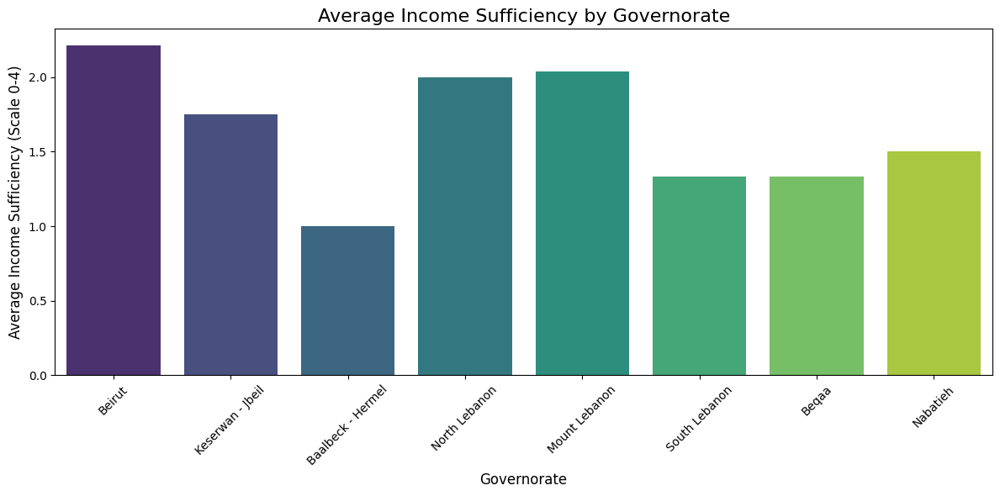
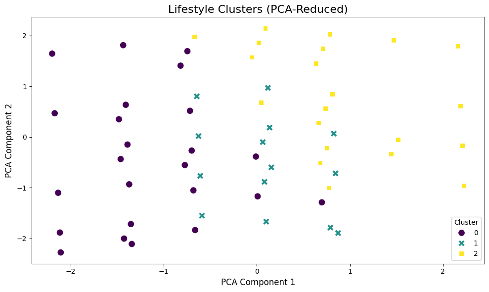
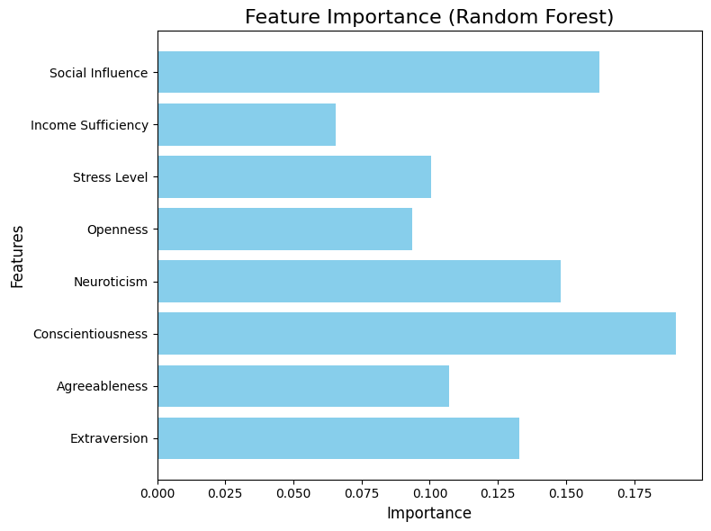
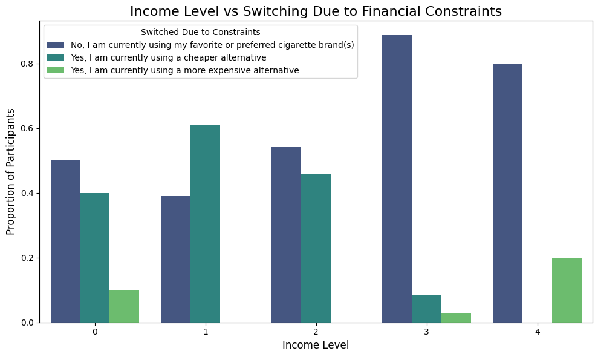

# Smoking Habits and Personality Traits: Machine Learning Mini-Project

## **Overview**
This mini-project explores the intricate relationships between **smoking behaviors**, **personality traits**, and **sociodemographic factors** using **machine learning** and data analysis techniques. By leveraging a rich dataset, I aimed to uncover insights into lifestyle patterns, regional disparities, and behavioral predictors of smoking frequency. 

## **Motivation**
Smoking is a pressing public health concern influenced by psychological and socioeconomic factors. Understanding these factors can guide personalized interventions, public health policies, and marketing strategies. This project sought to bridge the gap between **data science** and **behavioral insights** using a multi-method approach.

---

## **What I Did**

### **1. Personality Traits and Smoking Behavior**
Using the **Big Five Personality Traits**, I examined their impact on smoking frequency. 
- **Goal:** Identify which traits influence smoking frequency.
- **Approach:**
  - Mapped survey responses to numerical values.
  - Derived Big Five traits from personality questions.
  - Trained regression models (e.g., Random Forest, Linear Regression) to predict smoking frequency.
- **Key Findings:**
  - **Conscientiousness** (self-discipline) is negatively correlated with smoking.
  - **Neuroticism** (emotional instability) shows a weak positive correlation.

---

### **2. Lifestyle Clustering**
I grouped participants based on **Exercise Frequency**, **Social Media Usage**, and **Smoking Frequency** using **K-Means Clustering**:
- **Goal:** Identify lifestyle-based clusters to understand smoking behavior.
- **Approach:**
  - Standardized the data.
  - Applied K-Means and reduced dimensions using PCA for visualization.
- **Clusters:**
  - **Cluster 0:** High exercise, low smoking.
  - **Cluster 1:** Moderate behaviors across all factors.
  - **Cluster 2:** High smoking and high social media usage.

---

### **3. Regional Disparities in Smoking and Income**
I analyzed smoking frequency and income sufficiency across Lebanese governorates:
- **Goal:** Highlight geographic disparities in smoking and economic stress.
- **Approach:**
  - Mapped income sufficiency and smoking frequency to numerical scales.
  - Used Random Forest and visualization to explore regional patterns.
- **Key Findings:**
  - **Beirut** has the highest smoking frequency and income sufficiency.
  - Lower-income regions exhibit higher smoking rates, possibly due to economic stress.

---

### **4. Brand Loyalty and Switching Behavior**
I studied how financial constraints influence brand loyalty:
- **Goal:** Analyze how income impacts switching to alternative brands.
- **Approach:**
  - Categorized participants as **Loyal** or **Switched**.
  - Classified income levels and analyzed switching behavior trends.
- **Key Findings:**
  - Low-income participants are more likely to switch brands due to financial constraints.
  - High-income participants exhibit strong brand loyalty.

---

## **Methodology**
### **Data Preprocessing**
- Making sure the dataset includes no missing values and mapping categorical responses to numerical scales.

### **Modeling Techniques**
- **Regression Analysis:** Random Forest, XGBoost, SVR, and Linear Regression to predict smoking frequency.
- **Clustering:** K-Means Clustering and PCA for lifestyle segmentation.
- **Classification:** Logistic Regression and Decision Trees for brand loyalty analysis.

### **Visualization**
- Correlation matrices, bar plots, and PCA scatterplots to explore relationships and patterns.
- Regional disparities visualized through bar charts and heatmaps.

---

## **Key Findings**
1. **Personality Traits Matter**: Conscientiousness and Neuroticism are the most predictive traits for smoking behavior.
2. **Cluster Insights**: High smoking frequency aligns with low exercise frequency and high social media usage.
3. **Regional Disparities**: Smoking frequency is highest in Beirut, while income sufficiency varies significantly across regions.
4. **Financial Stress**: Low-income participants are more likely to switch brands due to economic constraints.

---

## **Conclusion**
This project demonstrated the power of **machine learning** and **data-driven analysis** in uncovering behavioral and regional patterns in smoking habits. From personality traits to financial stress, the insights gained can inform public health strategies, marketing efforts, and future research into smoking behavior.

---

## **Images**
### 1. Smoking Frequency by Governorate

### 2. Lifestyle Clusters (PCA-Reduced)

### 3. Feature Importance (Random Forest)

### 4. Income Level vs Switching Due to Financial Constraints

---

## **Future Work**
1. Include additional variables such as **stress levels**, **peer influence**, and **health awareness** to enhance predictive models.
2. Explore **time-series analysis** to understand smoking trends over time.
3. Implement **deep learning models** for more complex patterns in behavioral data.

---

## **How to Run**
1. Clone the repository and load the dataset (`2024_PersonalityTraits_SurveyData.xls`).
2. Run the Jupyter notebook to replicate the analysis.
3. Ensure necessary libraries are installed (`scikit-learn`, `pandas`, `matplotlib`, `seaborn`).

---

**Author**: Stefanie Samaha
